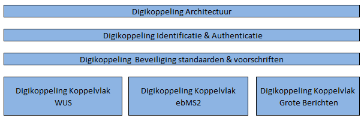

# Inleiding

Digikoppeling is een standaard voor berichtuitwisseling waarmee overheden op een veilige manier gegevens met elkaar kunnen uitwisselen.

## Doel

Dit document *Digikoppeling Overzicht Actuele Documentatie & Compliance* beschrijft de opzet en huidige versies van de Digikoppeling standaard. Ook geeft dit document aan hoe compliance aan de standaard kan worden bepaald en aangetoond.

## Doelgroep

Dit document is bedoeld voor ICT-professionals in de publieke sector en voor ICT-leveranciers die Digikoppeling (willen gaan) gebruiken.

## Verantwoording

Dit document is tot stand gekomen in samenwerking met leden van het Technisch Overleg Digikoppeling.

# Wat is Digikoppeling?

De Digikoppeling standaard is een verzameling van afspraken en principes voor berichtuitwisseling. Digikoppeling richt zich niet op de inhoud van het bericht maar op de “envelop” en op de logistiek van berichtenverkeer, kortom: de communicatiepatronen, adressering, beveiliging en betrouwbaarheid van berichten. Digikoppeling definieert verschillende koppelvlakken. In de koppelvlak specificaties worden de afspraken, eisen en te gebruiken technische standaarden in detail vastgelegd. Twee systemen die beiden hetzelfde digikoppeling koppelvlak ondersteunen kunnen gekoppeld worden en berichten uitwisselen op basis van een vooraf bepaald profiel.

Er zijn 3 soorten koppelvlakken:

- WUS (voor bevragingen met direct antwoord)

- EBMS2 (voor zowel meldingen (transacties) als bevragingen met een uitgesteld antwoord)

- Grote Berichten (voor uitwisselen van grote bestanden)

Daarnaast zijn er algemene afspraken die voor elk koppelvlak gelden:

- Architectuur

- Beveiliging

- Identificatie en authenticatie

De onderstaande figuur geeft de verschillende onderdelen van de digikoppeling standaard weer:

Deze onderverdeling komt ook terug in de documentatie van de Digikoppeling standaard. Het volgende hoofdstuk behandelt de beschikbare documentatie en geeft per document aan wat de inhoud is.

# Welke Digikoppeling documentatie is beschikbaar?

De Digikoppeling standaard is vastgelegd in een aantal documenten.

Dit hoofdstuk geeft aan welk onderdeel van de standaard in welk document wordt beschreven en geeft ook de samenhang weer tussen de verschillende soorten documenten.

## Structuur & opbouw documentatie

De onderstaande figuur geeft de opbouw weer van de Digikoppeling documentatie.

**Legenda**

<table class="legendum">
    <thead>
        <tr>
            <th><strong>Kleur</strong></th>
            <th><strong>Soort Document</strong></th>
        </tr>
    </thead>
    <tbody>
        <tr>
            <td class="green"></td>
            <td>Standaard documentatie</td>
        </tr>
        <tr>
            <td class="grey"></td>
            <td>Ondersteunende documentatie</td>
        </tr>
    </tbody>
</table>

**Beheer**

- De standaarddocumenten (groen aangegeven) vallen onder het beheer zoals geformaliseerd in het document [Beheermodel en releasebeleid].

- De ondersteunende documentatie wordt onderhouden door Logius als de beheerder van de standaard (en afgestemd met stakeholders/ gebruikers).

- Alle goedgekeurde documenten zijn te vinden op de website van Logius, [www.logius.nl](http://www.logius.nl/digikoppeling).

## Overzicht documentatie

### Algemene documentatie

- *Wat is Digikoppeling?*  
    Inleidend document over Digikoppeling

- *DK Overzicht Actuele Documentatie en Compliance*  
    Totaal overzicht van de documentatie en toelichting op compliance aan de standaard;

- *DK Beheermodel en Releasebeleid*

    Governance van de Digikoppeling standaard;

### Technische documentatie

*Technische documentatie algemeen*

- *DK Architectuur*

    Overzicht van de standaard, samenhang en architectuur. Dit document beschrijft op hoofdlijnen welke manier de standaard moet worden toegepast;

- *DK Identificatie en Authenticatie  
    *Uitgangspunten en principes voor identificatie- en authenticatieafspraken die gehanteerd worden tussen overheidsorganisaties bij gebruik van de Digikoppeling standaard;

- *DK Beveiliging standaarden en voorschriften  
    *Centraal document van beveiligingsvoorschriften en -standaarden die door de Digikoppeling Standaard verplicht worden gesteld;

*Technische documentatie koppelvlakken*

- *DK Koppelvlakstandaard WUS*   
    Koppelvlakspecificatie voor het gebruik van WUS voor het doen van bevragingen conform Digikoppeling;

- *DK Koppelvlakstandaard EBMS2*  
    Koppelvlakspecificatie voor het gebruik van ebMS 2.0 voor het doen van meldingen conform Digikoppeling;

- *DK Koppelvlakstandaard Grote Berichten*  
    Koppelvlakspecificatie voor het uitwisselen van grote berichten conform Digikoppeling. Grote berichten zijn XML berichten of bijlagen die een bepaalde bestandsgrootte overschrijden;

*Ondersteunende Documentatie*

- *DK Best Practices WUS*  
    Best Practices voor WUS implementatie;

- *DK Best Practices EBMS2*  
    Best Practices voor EBMS2 implementatie;

- *DK Best Practices Grote Berichten*  
    Best Practices voor Grote Berichten implementatie;

- *DK Gebruik en achtergrond certificaten*  
    Toelichting gebruik en achtergrond DK certificaten;

# Wat zijn de huidige versies van documenten?

De onderstaande tabel geeft de huidige versies van de Digikoppeling documenten weer.

| Document                                         | Versie | Normatief | Geldig vanaf | Geldig  tot |
|--------------------------------------------------|--------|-----------|--------------|-------------|
| Wat is Digikoppeling                             | 1.1.1  |           | 23-07-2018   |             |
| DK Beheermodel en releasebeleid                  | 1.5    |           | 19-10-2017   |             |
| DK Architectuur                                  | 1.5.1  | X         | 23-07-2018   |             |
| DK Koppelvlakstandaard WUS                       | 3.8    | X         | 11-01-2021   |             |
| DK Koppelvlakstandaard EBMS2                     | 3.3    | X         | 16-05-2019   |             |
| DK Koppelvlakstandaard Grote Berichten           | 3.3    | X         | 14-10-2020   |             |
| DK Identificatie en Authenticatie                | 1.4    | X         | 19-10-2017   |             |
| DK Beveiliging standaarden en voorschriften      | 1.3    | X         | 02-09-2020   |             |
| DK Overzicht  Actuele Documentatie en Compliance | 1.7    | X         | 11-01-2021   |             |
| DK Best Practices WUS                            | 1.10   |           | 19-10-2017   |             |
| DK Best Practices EBMS2                          | 3.2    |           | 16-05-2019   |             |
| DK Best Practices Grote Berichten                | 3.1    |           | 19-10-2017   |             |
| DK Gebruik en achtergrond certificaten           | 1.6    |           | 02-09-2020   |             |

Tabel 1: Digikoppeling document versies

Toelichting Normatief:  
  
In de kolom ‘Normatief’ wordt met ‘X’ aangegeven dat het document specifieke regels bevat waar men zich aan moet houden om te voldoen aan de Digikoppeling standaard (Zie ook H5 Wanneer ben ik Digikoppeling compliant).

De onderstaande tabel geeft de voorgaande versies van de Digikoppeling documenten weer.

| Document                                        | Versie | Normatief | Geldig vanaf | Geldig tot |
|-------------------------------------------------|--------|-----------|--------------|------------|
| DK Koppelvlakstandaard ebMS2                    | 3.2    | x         | 19-10-2017   | 16-05-2019 |
| DK Best Practices ebMS2                         | 3.1    |           | 19-10-2017   | 16-05-2019 |
| DK Koppelvlakstandaard WUS                      | 3.7    | X         | 16-05-2019   | 10-01-2021 |
| DK Koppelvlakstandaard WUS                      | 3.6    | X         | 21-08-2018   | 16-05-2019 |
| DK Koppelvlakstandaard WUS                      | 3.5    | X         | 19-07-2018   | 21-08-2018 |
| Wat is Digikoppeling                            | 1.1    |           | 19-10-2017   | 23-07-2018 |
| DK Architectuur                                 | 1.5    | X         | 19-10-2017   | 23-07-2018 |
| DK Koppel vlakstandaard Grote Berichten         | 3.2    | X         | 19-10-2017   | 14-10-2020 |
| DK Beveiliging standaarden en voorschriften     | 1.1    | X         | 19-10-2017   | 17-12-2019 |
| DK Beveiliging standaarden en voorschriften     | 1.2    | X         | 17-12-2019   | 02-09-2020 |
| DK Gebruik en achtergrond certificaten          | 1.5    |           | 19-10-2017   | 02-09-2020 |
| DK Overzicht Actuele Documentatie en Compliance | 1.5    | X         | 02-09-2020   | 10-01-2021 |
| DK Overzicht Actuele Documentatie en Compliance | 1.4    | X         | 17-12-2019   | 02-09-2020 |
| DK Overzicht Actuele Documentatie en Compliance | 1.3    | X         | 16-05-2019   | 17-12-2019 |
| DK Overzicht Actuele Documentatie en Compliance | 1.2    | X         | 30-07-2018   | 16-05-2019 |
| DK Overzicht Actuele Documentatie en Compliance | 1.1    | X         | 23-07-2018   | 30-07-2018 |
| DK Overzicht Actuele Documentatie en Compliance | 1.0    | X         | 19-07-2018   | 23-07-2018 |

Tabel 2: Vorige versies Digikoppeling documenten per koppelvlak

# Wanneer ben ik Digikoppeling compliant?

Voor de implementatie van een bepaald koppelvlak volgens de Digikoppeling standaard gebruikt u de algemene documenten van de standaard samen met de technische specificatie van het specifieke koppelvlak (bv WUS, EBMS2 of Grote Berichten).

## Documenten per koppelvlak

De onderstaande tabel laat zien welke documenten van toepassing zijn voor de implementatie van een bepaald koppelvlak. De kolom Koppelvlak toont per koppelvlak WUS, EBMS2, Grote Berichten de bijbehorende documentatie.

<!-- | **Digikoppeling Compliance**                      | **Koppelvlak** |                |                |                         |               |
|---------------------------------------------------|----------------|----------      |--------        |-------------------------|---------------|
| **Document**                                      | **WUS**        | **EBMS2**      | **GB**         | **Type**                | **Normatief** |
| DK Beheermodel en Releasebeleid                   | X              | X              | X              | Standaard               |               |
| DK Overzicht Actuele Documentatie en Compliance   | X              | X              | X              | Standaard               |               |
| DK Architectuur                                   | X              | X              | X              | Standaard               | X             |
| DK Koppelvlakstandaard WUS                        | X              |                | O1  | Standaard               | X             |
| DK Koppelvlakstandaard EBMS2                      |                | X              | O1  | Standaard               | X             |
| DK Koppelvlakstandaard Grote Berichten            | O1  | O1  | X              | Standaard               | X             |
| DK Identificatie en Authenticatie                 | X              | X              | X              | Standaard               | X             |
| DK Beveiliging standaarden en voorschriften       | X              | X              | X              | Standaard               | X             |
| DK Best Practices WUS                             | X              |                |                | Ondersteuning Standaard |               |
| DK Best Practices EBMS                            |                | X              |                | Ondersteuning Standaard |               |
| DK Best Practices Grote Berichten                 |                |                | X              | Ondersteuning Standaard |               |
| DK Gebruik en achtergrond certificaten            | X              | X              | X              | Ondersteuning Standaard |               | -->

<table class="dkcomp">
    <thead>
        <tr>
            <th><strong>Digikoppeling Compliance</strong></th>
            <th colspan="3" style="text-align: center;"><strong>Koppelvlak</strong></th>
            <th></th>
            <th></th>
        </tr>
    </thead>
    <tbody>
        <tr>
            <td><strong>Document</strong></td>
            <td><strong>WUS</strong></td>
            <td><strong>EBMS2</strong></td>
            <td><strong>GB</strong></td>
            <td><strong>Type</strong></td>
            <td><strong>Normatief</strong></td>
        </tr>
        <tr>
            <td class="normative">DK Beheermodel en Releasebeleid</td>
            <td class="wus">X</td>
            <td class="ebms">X</td>
            <td class="gb">X</td>
            <td class="normative">Standaard</td>
            <td class="normative"></td>
        </tr>
        <tr>
            <td class="normative">DK Overzicht Actuele Documentatie en Compliance</td>
            <td class="wus">X</td>
            <td class="ebms">X</td>
            <td class="gb">X</td>
            <td class="normative">Standaard</td>
            <td class="normative"></td>
        </tr>
        <tr>
            <td class="normative">DK Architectuur</td>
            <td class="wus">X</td>
            <td class="ebms">X</td>
            <td class="gb">X</td>
            <td class="normative">Standaard</td>
            <td class="normative">X</td>
        </tr>
        <tr>
            <td class="normative">DK Koppelvlakstandaard WUS</td>
            <td class="wus">X</td>
            <td class="ebms"></td>
            <td class="gb">O1</td>
            <td class="normative">Standaard</td>
            <td class="normative">X</td>
        </tr>
        <tr>
            <td class="normative">DK Koppelvlakstandaard EBMS2</td>
            <td class="wus"></td>
            <td class="ebms">X</td>
            <td class="gb">O1</td>
            <td class="normative">Standaard</td>
            <td class="normative">X</td>
        </tr>
        <tr>
            <td class="normative">DK Koppelvlakstandaard Grote Berichten</td>
            <td class="wus">O1</td>
            <td class="ebms">O1</td>
            <td class="gb">X</td>
            <td class="normative">Standaard</td>
            <td class="normative">X</td>
        </tr>
        <tr>
            <td class="normative">DK Identificatie en Authenticatie</td>
            <td class="wus">X</td>
            <td class="ebms">X</td>
            <td class="gb">X</td>
            <td class="normative">Standaard</td>
            <td class="normative">X</td>
        </tr>
        <tr>
            <td class="normative">DK Beveiliging standaarden en voorschriften</td>
            <td class="wus">X</td>
            <td class="ebms">X</td>
            <td class="gb">X</td>
            <td class="normative">Standaard</td>
            <td class="normative">X</td>
        </tr>
        <tr>
            <td class="informative">DK Best Practices WUS</td>
            <td class="wus">X</td>
            <td class="ebms"></td>
            <td class="gb"></td>
            <td class="informative">Ondersteuning Standaard</td>
            <td class="informative"></td>
        </tr>
        <tr>
            <td class="informative">DK Best Practices EBMS</td>
            <td class="wus"></td>
            <td class="ebms">X</td>
            <td class="gb"></td>
            <td class="informative">Ondersteuning Standaard</td>
            <td class="informative"></td>
        </tr>
        <tr>
            <td class="informative">DK Best Practices Grote Berichten</td>
            <td class="wus"></td>
            <td class="ebms"></td>
            <td class="gb">X</td>
            <td class="informative">Ondersteuning Standaard</td>
            <td class="informative"></td>
        </tr>
        <tr>
            <td class="informative">DK Gebruik en achtergrond certificaten</td>
            <td class="wus">X</td>
            <td class="ebms">X</td>
            <td class="gb">X</td>
            <td class="informative">Ondersteuning Standaard</td>
            <td class="informative"></td>
        </tr>
    </tbody>
</table>

1 O=gebruik van WUS óf ebMS2. Binnen de Grote Berichten standaard wordt eerst een metadatabericht gestuurd om een aan te kondigen dat een bestand klaar staat om te downloaden. Voor dit metadatabericht dient hetzij WUS, hetzij ebMS2 gebruikt te worden.

Tabel 3: Digikoppeling documentatie per koppelvlak

## Toelichting compliance

De tabel in de voorgaande paragraaf geeft aan welke combinatie van documenten tezamen een complete specificatie vormt voor Digikoppeling op basis van WUS, EBMS2 of Grote berichten. Een koppelvlak implementatie voldoet aan de digikoppeling standaard als deze conform de principes, afspraken en gestelde eisen uit de normatieve documenten is uitgewerkt. Om de compliance van software in de een praktijksituatie te testen is de Digikoppeling Compliancy Voorziening ontwikkeld. Deze voorziening is onderdeel van het Digikoppeling Portaal en beschikbaar op <https://portaal.digikoppeling.nl>.

De Digikoppeling Compliancy Voorziening moet gezien worden als een hulpmiddel. Bij afwijking tussen de documentatie en de Compliance Voorziening zijn de eisen in de documentatie leidend bij het beoordelen of software de Digikoppeling standaard correct implementeert.
